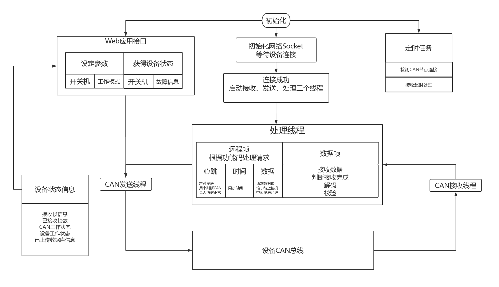

# CAN模块使用说明

## 模块功能

1. 接收种猪测定设备发送的测定数据
2. 监控每台设备的运行情况
3. 提供接口给Web应用程序

## 模块结构



## 协议

1. CAN协议
    > 标准帧  
    > 11位ID中，高3位作为功能码，低8位作为节点ID，0号ID保留，最大允许255台设备  
    > 多数使用远程帧传输，使用功能码识别消息类型，节点ID识别设备号  
    > 上传数据使用数据帧传输，长度最长为8  

2. 设备命令（*开关机，工作模式切换*）
    > 直接通过远程帧发送，格式: *功能码+节点ID*

3. 接收设备请求
    > 心跳请求：定时监控，原格式发回
    > 时间请求：同步设备时间，将时间按 *2位数年+月+日+时+分+秒+0+和校验*共8个字节发送至对应设备  
    > 数据请求：设备采集完一次数据后会发送数据请求，若此时主机不空闲（*正在接收其他设备的数据*）则会先放入队列，等待空闲；若主机空闲且在超时允许范围内则将此请求原格式发回，以示可以开始接收数据  

4. 数据传输
    > 数据格式JSON
    > 非末帧功能码不为零，末帧功能码为零，末帧只带有一个字节，内容为帧数，用以校检是否缺帧  
    > JSON字符串发送时拆分成字节数组，需要用"utf-8"解码成字符串，再用"json.load"解码成字典，此过程成功则发送*接收完成*远程帧，否则清除缓存
    > 接收完成后将数据对象放入队列等待上传，为防止掉电丢失，每次将队列序列化保存在硬盘中  

5. 设备监控
    > 在心跳请求中，`dlc`位包含了设备状态信息[DEVICE_STATUS_CODE](DEVICE_STATUS_CODE)
    > 定时对心跳请求计数，若长时间未收到某台设备的心跳，则状态信息设为"disconnect"  
    > 接收到的心跳不在设备目录中时按空白模版新建  

## 格式

* USR以太网模块设为UDP协议，模块会向主机IP发送一个数据，主机即可获得模块IP。若主机IP更改需要**修改代码**和模块配置

``` python
FUN_CODE_DICT = {               # 远程帧时的功能码
    'heart_beat': 0,
    'data_object_request': 1,
    'time_stamp_request': 2,
    'open_device': 3,
    'close_device': 4,
    'recv_complete': 5,
    'train_device': 6,
    'test_device': 7
}
DEVICE_STATUS_CODE = ['00001', 'OFF', 'ON', '00002', '00003', '00004', '00005', '00006', '00007', '00008']
```

## 变量

* data_Receiving --- 0：主机空闲，非0：主机正在接收`NodeID`为`data_Receiving`  
* device_status --- {"<节点>",{"frame": [<第一帧>,<第二帧>...], 'frame_status':<帧计数>, "can_status": <CAN状态，非0表示正常连接>, "work_status": <设备工作信息>}}  

## 函数

* Web应用接口
  > CANCommunication --- 'CAN模块，阻塞型'  
  > setDeviceStatus --- setDeviceStatus '设定测定站状态，[[nodeId,"open_device"],[nodeId,"close_device"]]'
  > getDeviceStatus ---  '获得测定站状态,返回["ON","00000"]'
* 逻辑
  > getFunctionCode --- '获取功能码'  
  > getNodeID --- '获取节点'  
  > syncTime --- '同步时间'  
  > deviceStart --- '上位机命令'  
  > dataAnalyse --- '数据包解析'  
  > clearTemp --- '解除接收态'  
  > timeoutHandler --- '接收超时处理'  
  > network_management --- '节点状态'  
  > nodeMonitor --- '节点监控定时函数'  
  > promiseRequest ---'处理数据包发送请求'  
  > sysInit --- '设备状态初始化'  
* 系统
  > CANHand --- 'CAN处理'  
  > CANSocket --- 'CAN Socket 初始化'  
  > CANSend --- 'CAN发送'  
  > CANRecv --- 'CAN接收'  
  > serverSend --- '上传数据'  
  > timer --- '定时任务'  
* Usr通信
  > arbitration_id,dlc,data,timestamp,is_extended_id,is_remote_frame属性 --- '消息体'  
  > msg2byte --- '消息转字节'  
  > byte2msg --- '字节转消息'  
